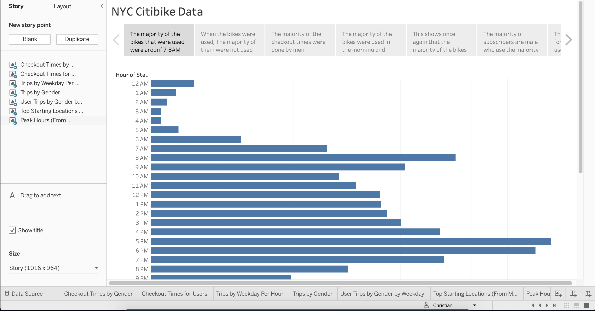

# bikesharing

## Purpose 
The purpose of this activity is to provide more work to convince investors that a bike-sharing program in Des Moines is a solid buisness proposal. In order to solidify this proposal, one of the stakeholders would like to see a complete bike trip analysis. For this chalenge, I used Pandas to change the "tripduration" colum from an integer to a datetime datatype. Then, with the new DataFrame I:

  - Showed the length of time that bikes are checked out for all riders and genders.
  
  - SHowed the number of bike trips for all riders and genders for eac hourof each day of the week.
  
  - Showed the number of bike trips for each type of user and gender for each day of the week.
  
This was done via visualizations with Tableau in order for others to better understand the data I present to them.

## Change Trip Duration to a Datetime Format
Using Python and Pandas, I converted the "tripduration" column from an integer to a datetime datatype to get the time in hours, minutes, and seconds. After I converted the DataFrame, I exported it as a CSV file to use in Deliverables 2 and 3.

### DataFrame

## Create Visualizations for the Trip Analysis
Using Tableau, I created the following visualizations:
  - How long bikes are checked out for all riders and genders.
  
  - How many trips are taken by the hour for each day of the week, for all riders and genders.
  
  - Provided a breakdown of what days of the week a user might be more likely to check out a bike, by type of user and gender.
  
This was possible by exporting Deliverable 1 as a CSV file into a new Tableau public workbook.

### Data
#### Peak Hours

#### Checkout Times for Users

#### Checkout Times by Gender

#### Trips by Weekday

#### Trips by Gender (Weekday Per Hour)

#### User Trips by Gender by Weekday

#### Starting Locations

## Create a Story 
For Deliverable 3, I created a story in Tableau and described the key outcomes of the NYC Citibike analysis for this whole module and in Deliverable 2

### Story

## Summary
Based on the results gathered, while the Citibike service is very use ful and convenient, it is easily noticable the time of day as well as the type of people who take the most advantage of the service. Across all graphs, a conclusion can easily be drawn stating that the majority of bike users are men and they use these bikes in the mornings and evenings around the time they leave for work as well as head home. The majority of bikes are used around 7-8 AM and they are also used the most around 5-6 PM. In addition, the majority of the bikes are not used for a very long time. Mainly just under 20 minutes which means that the users of the bikes most liekly live close to where they work but not too close where they can just walk (or they just choose to se the bikes regardless). During the week, the bikes are heavily used from Monday-Friday which also implies that the bikes are mainly used to help individuals get to and from work. 

In addition to having the data presented now. I beleive the information can be respresented in other ways as well. One visualization that comes to mind if a simple pie chart showing the percentages of the genders. Even though we already know that men are the majority of users in this dataset, it would be insightful to see how much (percetnage wise) they cover. Going off this first suggestion, another good visualization that can be used is another pie chart but instead of showing the gender, it can show the percentage of subscribers compared to customers. I made a graph showing the User Trips by Gender by Weekday which showes the subscriber in color shading form. having another pie chart showing the actual percentages of subscribers and customers can highlight the amount of subscribers across all genders and can help in showing the majority of the kinds of users.

## Resources
- [Link to Dashboard](https://public.tableau.com/app/profile/christian4489)

- Python 

- Pandas

- Tableau Public
